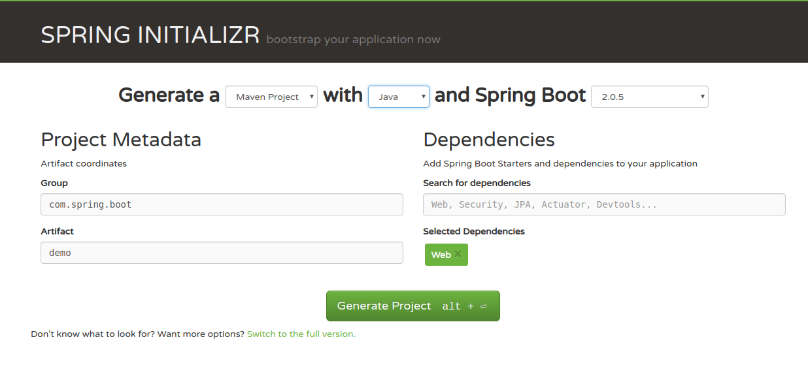
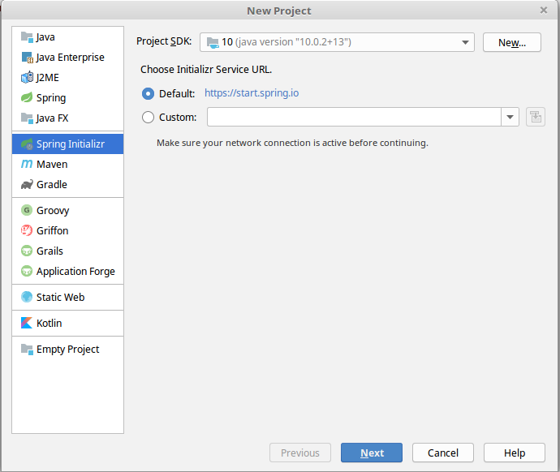
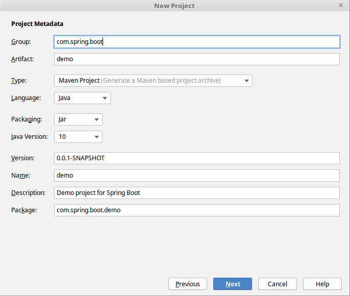
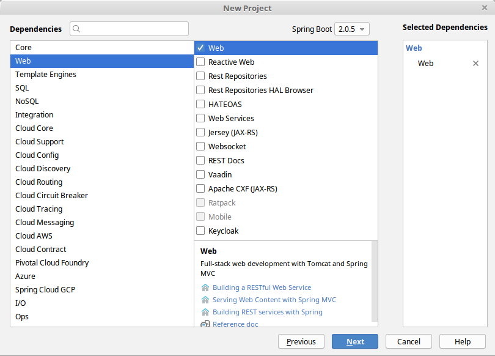
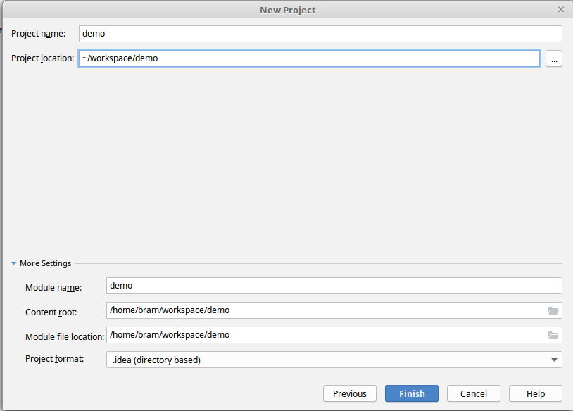
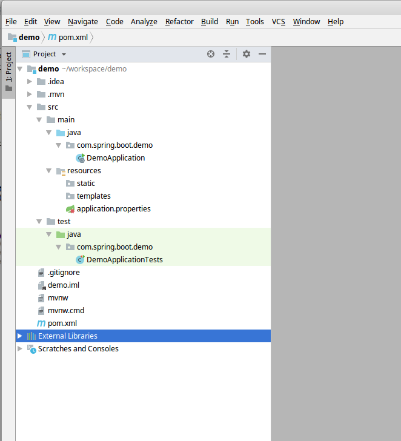

# Spring Boot demo


## How to create your own

### Create skeleton
You have two options for this, either use the Spring Initializr website on [Spring.io](https://start.spring.io/)
or use the Initializr plugin in your Java IDE. Both Eclipse and IntelliJ have this option.

#### Spring.io
Browse to [start.spring.io](https://start.spring.io/) and use the wizard to create a project.



#### IDE Plugin

Select the Spring Initializr and the JDK version. This is the wizard in IntelliJ.


Enter the Group and ArtifactId, language and Java Version along with application info. This is typically info entered in the Maven POM


Choose which Spring dependencies you would like to add, most commonly Web. You can add extra dependencies later if needed.
For this example, we will add Web.


Enter the directories where the project should be created


This results in a project with the following content



### Main SpringBootApplication class
The skeleton project contains an Application class annotated with `@SpringBootApplication` to bootstrap the application.
In our example, this is the class `DemoApplication`. By placing this class in the main package, each class within that package 
and any sub-packages will be component-scanned and picked up by Spring to create Spring Beans.

### Controller
Create a controller-class with annotation `@RestController`. Create a method with a mapping that serves the root-url:
```java
@RestController
public class SimpleController {
    @GetMapping("/")
    String hello() {
        return "Hello from Spring Boot!";
    }
}
```

This completes the minimal Hello World web-app using Spring Boot. Let's startit.

## How to Start
These commands are all run from your terminal application

### Maven:
```bash
mvn spring-boot:run
``` 

### Gradle:
```bash
gradle bootRun
``` 

Java:
* Build a jar using
```bash
mvn package
``` 
* Start the jar using
```bash
java -jar demo.jar
``` 
* Or if you on *nix systems (Linux, Mac OSX or UNIX), you can instead run jars natively:
```bash
chmod 755 demo.jar
./demo.jar
```

Start the application and open the url to [localhost](http://localhost:8080). 

## Dev-tools
Let's add a plugin that adds support for several convenient tools, like code-insight in the application.properties.
Add the following dependency to the POM:
```xml
<dependency>
    <groupId>org.springframework.boot</groupId>
    <artifactId>spring-boot-devtools</artifactId>
</dependency>
```


