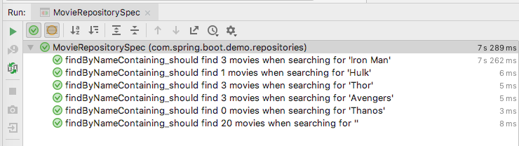

# Spring Boot demo


## How to create your own

### Create skeleton
You have two options for this, either use the Spring Initializr website on [Spring.io](https://start.spring.io/)
or use the Initializr plugin in your Java IDE. Both Eclipse and IntelliJ have this option.

#### Spring.io
Browse to [start.spring.io](https://start.spring.io/) and use the wizard to create a project.


#### IDE Plugin

Select the Spring Initializr and the JDK version. This is the wizard in IntelliJ.


Enter the Group and ArtifactId, language and Java Version along with application info. This is typically info entered in the Maven POM


Choose which Spring dependencies you would like to add, most commonly Web. You can add extra dependencies later if needed.
For this example, we will add Web.


Enter the directories where the project should be created


This results in a project with the following content


### Main SpringBootApplication class
The skeleton project contains an Application class annotated with `@SpringBootApplication` to bootstrap the application.
In our example, this is the class `DemoApplication`. By placing this class in the main package, each class within that package 
and any sub-packages will be component-scanned and picked up by Spring to create Spring Beans.

### Controller
Create a controller-class with annotation `@RestController`. Create a method with a mapping that serves the root-url:
```java
@RestController
public class SimpleController {
    @GetMapping("/")
    String hello() {
        return "Hello from Spring Boot!";
    }
}
```

This completes the minimal Hello World web-app using Spring Boot. Let's startit.

## How to Start
These commands are all run from your terminal application

### Maven:
```bash
mvn spring-boot:run
``` 

### Gradle:
```bash
gradle bootRun
``` 

Java:
* Build a jar using
```bash
mvn package
``` 
* Start the jar using
```bash
java -jar demo.jar
``` 
* Or if you on *nix systems (Linux, Mac OSX or UNIX), you can instead run jars natively:
```bash
chmod 755 demo.jar
./demo.jar
```

Start the application and open the url to [localhost](http://localhost:8080). 

## Dev-tools
Let's add a plugin that adds support for several convenient tools, like code-insight in the application.properties.
Add the following dependency to the POM:
```xml
<dependency>
    <groupId>org.springframework.boot</groupId>
    <artifactId>spring-boot-devtools</artifactId>
</dependency>
```

## Persistence

Here things start to get interesting. Most application have some kind of persistence. We will add support for an in-memory database
and create classes that interact with this database. This will include Hibernate, JPA and H2.

Let's start by adding the following dependencies to the POM:
```xml
<dependency>
    <groupId>org.springframework.boot</groupId>
    <artifactId>spring-boot-starter-data-jpa</artifactId>
</dependency>
<dependency>
    <groupId>com.h2database</groupId>
    <artifactId>h2</artifactId>
    <scope>runtime</scope>
</dependency>
```

Notice that you might need to add JAXB-API for projects using JDK 9+, since this was removed / deprecated.
```xml
<dependency>
    <groupId>javax.xml.bind</groupId>
    <artifactId>jaxb-api</artifactId>
</dependency>
```

### Entity
Create a POJO class with the following annotations and generate simple getters and setters
```java
@Entity
public class Movie {

    @Id
    @GeneratedValue
    private Long id;
    private String name;
    private LocalDate release;
    private String imdb;

    public Movie(String name, LocalDate release, String imdb) {
        this.name = name;
        this.release = release;
        this.imdb = imdb;
    }
}
```

The `@Entity` annotation will tell Spring to use this class as a Model-class. `@Id` indicates the identifier field and `@GeneratedValue` 
is used for derived values, like primary keys. These will typically be filled in using database sequences.


### Repository
Create an `interface` called `MovieRepository`. By extending the Generic `CrudRepository` and configuring the correct Entity and Id, 
Spring will create an implementation we can use with methods to find, create, save and delete entities of this type.

```java
public interface MovieRepository extends CrudRepository<Movie, Long> {
  // No code needed
}
```

To explicitly create a find method that takes a specific entity field, you can add a method declaration like this:
```java
  List<Movie> findByName(String name);
```

Note that you don't have to implement the method itself. The format of the method-call is used by Spring to inject the actual implementation.
Spring JPA can also combine queries with methods like:
```java
  List<Movie> findByNameAndAndRelease(String name, LocalDate release);
```

Finding entities by comparing a field with in-between:
```java
  List<Movie> findByReleaseBetween(LocalDate start, LocalDate end);
```

For an overview of the options, review the [Spring Query method reference](https://docs.spring.io/spring-data/jpa/docs/current/reference/html/#repositories.query-methods.details).

### Seed-data
Let's create some entities to pre-fill the database. You can create a class annotated with `@Component`, with the `MovieRepository` 
that is annotated with an `@Autowired`. This will auto-inject that bean into the class, so we can use it.

```java
@Component
public class Bootstrap {
    @Autowired
    MovieRepository movieRepository;

    public void prefillDatabase() {
        movieRepository.saveAll(Arrays.asList(
                new Movie("Iron Man", LocalDate.of(2008, 5, 2), "https://www.imdb.com/title/tt0371746/"),
                new Movie("The Incredible Hulk", LocalDate.of(2008, 6, 13), "https://www.imdb.com/title/tt0800080/")
                // Etc
        ));
    }
}
```

Next you can add this Bootstrap class to the main Application and make sure it's called. Inject it with the `@Autowired` annotation.
Make the main Application class implement the interface `CommandLineRunner` and implement the `run`method with the following body:
```java
@SpringBootApplication
public class DemoApplication implements CommandLineRunner {

    @Autowired
    Bootstrap bootstrap;

    public static void main(String[] args) {
        SpringApplication.run(DemoApplication.class, args);
    }

    @Override
    public void run(String... args) throws Exception {
        bootstrap.prefillDatabase();
    }
}
```

We are using this data both for testing purposes and as a starting point for demoing different aspects of the application.
You could also call the prefill-code in a test-setup if you strictly use it for automated testing.

### Testing

Let's create a Test-class. In folder `main/test/groovy` create a package `com.spring.boot.demo.repositories`. Within this package, 
create a Groovy-class called `MovieRepositoryTest` with the following code:

```groovy
@ContextConfiguration
@SpringBootTest
class MovieRepositoryTest extends Specification {

    @Autowired
    MovieRepository movieRepository

    @Unroll
    def "findByNameContaining_should find #expected movies when searching for '#query'"() {
        given:
        movieRepository

        when:
        def result = movieRepository.findByNameContaining(query)

        then:
        result.size() == expected

        where:
        query       ||  expected
        "Iron Man"  ||  3
        "Hulk"      ||  1
        "Thor"      ||  3
        "Avengers"  ||  3
        "Thanos"    ||  0
        ""          ||  20
    }
}
```

Pay close attention to the annotations within this code. Since this is Groovy code, we can do some cute things. 
The method name is a string, with some replacement variables within it. Spock enables us to use labeled blocks, like given, when, then.
These indicate different functional parts of the test. 

| label | function                              |
|-------|---------------------------------------|
| given | setup                                 |
| when  | stimulus: if this code is executed... |
| then  | condition: ... this should be true    |
| where | parameters: with these values         |

Refer to the [Spock documentation](http://spockframework.org/spock/docs/1.2/spock_primer.html) for more details.

In our example, we execute the same code several times using a different query. This should always result in a list, but with different lengths.
Each line in the where-table indicates a test with a different query and the corresponding expected size of the resulting list.
And then there is the Groovy magic of the method name. You can see the variables, which will be replaced with the parameters in the where-table.
Run the following Maven target:
### Maven:
```bash
mvn clean test
``` 

Or run the specification from IntelliJ. This will give you the following test-results:



